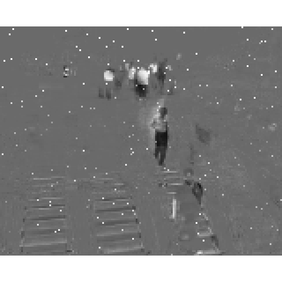

```{r echo = F, warning = F, message = F}
library(bsid)
library(useful.lovetoken)
pacman::p_load(dplyr, bmp, pixmap, animation, corpcor, progress, servr, knitr)
opts_chunk$set(fig.path='figure/', warning = F, message = F)
```

## creating M matrix

M matrix 만들기 `creat_vm()`

```{r}
creat_vm(path="./example_data/airport_sub/")
M <- bsid_env$M
```

$M$ 확인하기 `save_anipic()`

```{r}
save_anipic(M, save.name="airport_sub_M")
```


## PCP algorithm

Principal Component Pursuit algorithm 를 이용하여 L, S matrix 만들기 `PCP()`

```{r}
PCP(M)
L <- bsid_env$L
S <- bsid_env$S
```

$L, S$ 확인하기

```{r}
save_anipic(L, save.name="airport_sub_L")
save_anipic(S, save.name="airport_sub_S")
```

$L$ matrix


$S$ matrix


## M matrix 에 PWN<sub>Point type White Noise</sub> 추가하기

임의위치의 픽셀값을 1로 부여하여 잡음을 추가 `WN_point()`

```{r}
WN_point(M)
Mstar <- bsid_env$Mstar
```

$M^\star$ 확인하기

```{r}
save_anipic(Mstar, save.name="airport_sub_Mstar")
```


## Mstar PCP

```{r}
PCP(Mstar)
Lstar <- bsid_env$L
Sstar <- bsid_env$S

save_anipic(Lstar, save.name="airport_sub_Lstar")
save_anipic(Sstar, save.name="airport_sub_Sstar")
```

$L^\star$ 확인하기


$S^\star$ 확인하기



## Image Denoising

$M^\prime$ 만들기 (method="MDMR_filter")

```{r}
denoising(Mstar, method="MDMR_filter", W0=1, lambda=0.1)
Mprime <- bsid_env$prime

save_anipic(Mprime, save.name="airport_sub_Mprime")
```

$M^\prime$ 확인하기


$S^\prime$ 만들기 (method="median_filter")

```{r}
denoising(Sstar, method="MDMR_filter", W0=1, lambda=0.1)
Sprime <- bsid_env$prime

save_anipic(Sprime, save.name="airport_sub_Sprime")
```

$S^\prime$ 확인하기


$S^\prime + L^\star$ 확인하기

```{r}
Mpprime <- Sprime + Lstar

save_anipic(Mpprime, save.name="airport_sub_Mpprime")
```


## MSE compare

$$\mid\mid{M-M^{\prime}}\mid\mid_{F}$$

```{r}
norm(M-Mprime, type="F")
```

$$\mid\mid{M-(S^{\prime} + L^{\star})}\mid\mid_{F}$$

```{r}
norm(M-Mpprime, type="F")
```

$$\mid\mid{M-M^{\prime}}\mid\mid_{F} \ \ge\  \mid\mid{M-(S^{\prime} + L^{\star})}\mid\mid_{F}$$

- email : <lt.lovetoken@gmail.com>
- blog : <https://lovetoken.github.io/>
