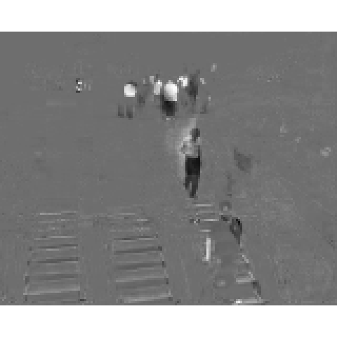

# Overview of bsid package


```
##       open_packages before_version current_version
## 1         animation            2.4             2.4
## 2               bmp            0.2             0.2
## 3              bsid          0.113           0.113
## 4           corpcor          1.6.8           1.6.8
## 5             dplyr          0.4.3           0.4.3
## 6             knitr         1.12.3          1.12.3
## 7            pixmap         0.4-11          0.4-11
## 8          progress          1.0.2           1.0.2
## 9             servr          0.2.3           0.2.3
## 10 useful.lovetoken          0.124           0.124
```

Background Subtraction and Image Denoising (BSID) R package

*********************************************************************

# Example bsid package in R

## creating M matrix

Mmatrix 만들기


```r
creat_vm(path="./example_data/airport_sub/")
M <- bsid_env$M
```

M matrix 확인하기


```r
save_anipic(M, save.name="airport_sub_M")
```


## PCP algorithm


```r
PCP(M)
L <- bsid_env$L
S <- bsid_env$S
```

L, S matrix 확인하기


```r
save_anipic(L, save.name="airport_sub_L")
save_anipic(S, save.name="airport_sub_S")
```

L matrix


S matrix



## Mmatrix 에 PWN<sub>Point type White Noise</sub> 추가하기


```r
WN_point(M)
Mstar <- bsid_env$Mstar
```

Mstar 확인하기


```r
save_anipic(Mstar, save.name="airport_sub_Mstar")
```


## Mstar PCP


```r
PCP(Mstar)
Lstar <- bsid_env$L
Sstar <- bsid_env$S
```


```r
save_anipic(Lstar, save.name="airport_sub_Lstar")
save_anipic(Sstar, save.name="airport_sub_Sstar")
```

Lstar matrix


Sstar matirx


## Image Denoising

coming soon.

## MSE compare

coming soon.

# Author & Maintainer

HyoJin_Song <lt.lovetoken@gmail.com>, <http://lovetoken.dothome.co.kr/>

**********************************************************************


