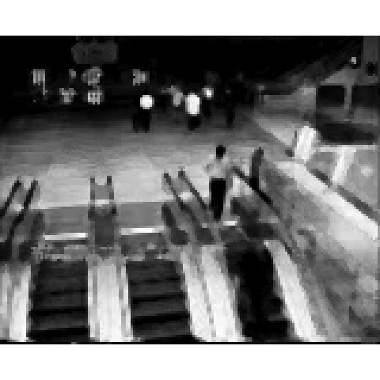
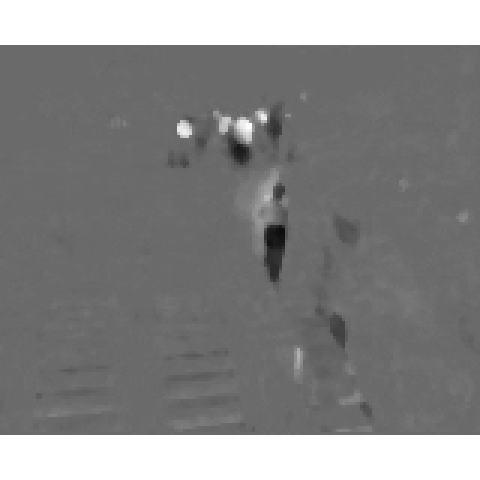
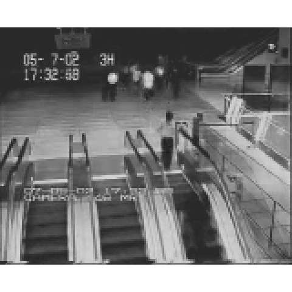

# Overview of bsid package


Background Subtraction and Image Denoising (BSID) R package

*********************************************************************

# Example bsid package in R

## creating M matrix

M matrix 만들기 `creat_vm()`


```r
creat_vm(path="./example_data/airport_sub/")
M <- bsid_env$M
```

$M$ 확인하기 `save_anipic()`


```r
save_anipic(M, save.name="airport_sub_M")
```


## PCP algorithm

Principal Component Pursuit algorithm 를 이용하여 L, S matrix 만들기 `PCP()`


```r
PCP(M)
L <- bsid_env$L
S <- bsid_env$S
```

$L, S$ 확인하기


```r
save_anipic(L, save.name="airport_sub_L")
save_anipic(S, save.name="airport_sub_S")
```

$L$ matrix


$S$ matrix


## M matrix 에 PWN<sub>Point type White Noise</sub> 추가하기

임의위치의 픽셀값을 1로 부여하여 잡음을 추가 `WN_point()`


```r
WN_point(M)
Mstar <- bsid_env$Mstar
```

$M^\star$ 확인하기


```r
save_anipic(Mstar, save.name="airport_sub_Mstar")
```


## Mstar PCP


```r
PCP(Mstar)
Lstar <- bsid_env$L
Sstar <- bsid_env$S

save_anipic(Lstar, save.name="airport_sub_Lstar")
save_anipic(Sstar, save.name="airport_sub_Sstar")
```

$L^\star$ 확인하기


$S^\star$ 확인하기


## Image Denoising

$M^\prime$ 만들기 (method="median_filter")


```r
denoising(Mstar, method="median_filter", W0=1, lambda=0.3)
Mprime <- bsid_env$prime

save_anipic(Mprime, save.name="airport_sub_Mprime")
```

$M^\prime$ 확인하기



$S^\prime$ 만들기 (method="median_filter")


```r
denoising(Sstar, method="median_filter", W0=1, lambda=0.3)
Sprime <- bsid_env$prime

save_anipic(Sprime, save.name="airport_sub_Sprime")
```

$S^\prime$ 확인하기



$S^\prime + L^\star$ 확인하기


```r
Mpprime <- Sprime + Lstar

save_anipic(Mpprime, save.name="airport_sub_Mpprime")
```



## MSE compare

coming soon.

# **bsid** package (in R) Maintainer

Song HyoJin 

- Korean R user
- [HUFS](http://www.hufs.ac.kr/user/hufsenglish/) student 
- email : <lt.lovetoken@gmail.com>
- blog : <http://lovetoken.dothome.co.kr/>

**********************************************************************


